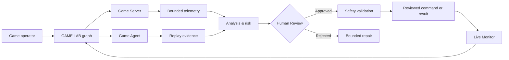

# GAME LAB

## Local Game Bridge

GAME LAB can give GPT a bounded structured game state without screenshots or GraphQL. The local adapter contract is `game-lab.control.v1`:

- `GET /v1/status` reports adapter and session health.
- `GET /v1/observation` returns player, mission, environment and nearby-entity state with a checkpoint ID.
- `POST /v1/actions` accepts one allowlisted action tied to that exact checkpoint.
- `POST /v1/stop` immediately stops movement and queued actions.

For the local demo:

```bash
npm run bridge:demo
```

Then open **Settings → Connections → Local Game Bridge**, keep `http://127.0.0.1:4317`, and select **Save & connect**. In version 1, GAME LAB and the game adapter intentionally run on the same Windows PC. Every GPT gameplay action requires Human Review and its observation/action receipt is stored as a workspace-scoped SQLite checkpoint.

[](https://github.com/Complexity-ML/game-lab/actions/workflows/fast-pr.yml)
[](https://github.com/Complexity-ML/game-lab/actions/workflows/setup-preview.yml)
[](https://github.com/Complexity-ML/game-lab/actions/workflows/macos-release.yml)
[](https://github.com/Complexity-ML/game-lab/releases/latest)

GAME LAB is a local-first visual studio for private game-server operations and governed game agents. It combines an Electron workbench, a relational SQLite ledger and a small Tauri Setup that builds the native application locally for the current computer.

Two first-class stickers extend the shared LAB graph:

- **Game Server** — an owned or explicitly authorized FiveM, RedM or generic server with bounded health, player and resource telemetry.
- **Game Agent** — an NPC, test player or governed operator constrained to a private server, allowlisted actions and an immediate emergency stop.

## How it works



Every material action stays visible in the graph. The agent can investigate and propose, while the host keeps authorization, review, rollback and post-condition validation deterministic.

## Included demos

Open **Settings → Examples** and choose one of the two ready-to-run canvases.

```mermaid
flowchart TB
  subgraph OPS["FiveM Server Ops"]
    S1["Private FiveM server"] --> S2["Health monitor"]
    S2 --> S3["Incident analysis"]
    S3 --> S4["Operational risk"]
    S4 --> S5["Human Review"]
    S5 --> S6["Single-resource restart"]
    S6 --> S7["Recovery validation"]
  end

  subgraph ARENA["Agent Arena"]
    A1["Isolated FiveM shard"] --> A2["Game Agent"]
    A2 --> A3["Replay scoring"]
    A3 --> A4["Safety risk"]
    A4 --> A5["Human Review"]
    A5 --> A6["Safety gate"]
    A6 --> A7["Agent result"]
  end
```



- **FiveM Server Ops** diagnoses one failed resource, records affected test players, asks a human to approve a single-resource restart, validates recovery and returns to monitoring.
- **Agent Arena** runs an AI test driver on an isolated shard, scores its replay, materializes safety risk and validates the policy before another private run.

## Install on macOS

The recommended command downloads the checksum-verified Tauri helper for Apple Silicon or Intel, installs it for the current user and opens **GAME LAB Setup**:

```bash
curl -fsSL https://github.com/Complexity-ML/game-lab/releases/download/setup-latest/install-game-lab-macos.sh | bash
```

To download the Tauri Setup DMG instead:

```bash
SETUP_ARCH=$([ "$(uname -m)" = "arm64" ] && echo arm64 || echo x64); curl -fL "https://github.com/Complexity-ML/game-lab/releases/download/setup-latest/GAME-LAB-Setup-${SETUP_ARCH}.dmg" -o /tmp/GAME-LAB-Setup.dmg && open /tmp/GAME-LAB-Setup.dmg
```

To build the newest `main` revision instead of the latest stable release:

```bash
curl -fsSL https://github.com/Complexity-ML/game-lab/releases/download/setup-latest/install-game-lab-macos.sh | bash -s -- --channel main
```

Setup is intentionally source-first: it downloads a managed Node.js runtime once, fetches the selected immutable source, runs the locked local build, installs `GAME LAB.app` in `~/Applications`, replaces it atomically and keeps one rollback copy. The Setup preview is unsigned and unnotarized, so macOS may ask for explicit approval.

No Apple certificate or repository secret is required for this path. GitHub Actions only builds the small Tauri bootstrap artifacts; the Electron application is built locally by Setup for the current machine.

## Release model

- **Stable** resolves the latest published `v*` source release.
- **Main** resolves the current `main` commit and is explicitly opt-in.
- [`setup-latest`](https://github.com/Complexity-ML/game-lab/releases/tag/setup-latest) always exposes the current Tauri Setup downloads.
- The stable source release and Tauri Setup use only GitHub's built-in workflow token; no signing secret is embedded in the repository.

## Safety boundary

GAME LAB is designed for servers you own or are explicitly authorized to operate. It does not support public-server automation, anti-cheat bypass, harassment, credential extraction or private raw-player-data collection.

- Server commands are allowlisted and reviewed.
- Agent actions are limited to private evaluation environments.
- Human Review protects material commands and policy promotion.
- Emergency stop is a mandatory Game Agent contract.
- Every committed graph revision is restorable.
- Closing GAME LAB stops monitors and agent actions; no hidden service is installed.

## Technology

- React 19, TypeScript, Vite and React Flow
- Electron desktop workbench
- Relational SQLite workspace and revision ledger
- Tauri 2 source-first Setup
- Optional bounded catalog and MCP connectors
- Vitest and Rust validation

Workspace data lives in `game-lab.sqlite`. Graph nodes, edges, versions, evidence and checkpoints are stored in normalized tables rather than JSON payload blobs.

## Run locally

Requirements: Node.js 20+ and npm.

```bash
npm install
npm run electron:dev
```

Renderer only:

```bash
npm run dev
```

Validation:

```bash
npm test
npm run build
npm run build:electron
cargo check --manifest-path apps/bootstrap-installer/src-tauri/Cargo.toml
```

Run the Tauri Setup locally:

```bash
npm install --prefix apps/bootstrap-installer
npm run setup:dev
```

Build only the small Setup package:

```bash
npm run setup:build:mac
```

## Project structure

```text
electron/                    Electron shell, SQLite and secure IPC boundary
apps/bootstrap-installer/    Tauri Setup for Stable and Main
src/components/              Cards, panels, settings and review UI
src/domain/                  Game graph, reports, contracts and presets
src/hooks/                   Player and workspace orchestration
src/views/                   Library, canvas, inspector and results
```

## License

Apache License 2.0. See [LICENSE](LICENSE).
