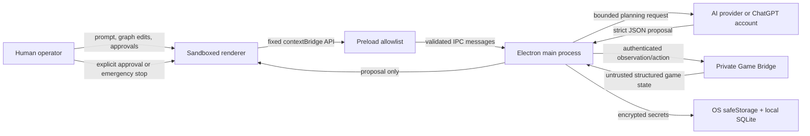

# GAME LAB threat model

This document models the desktop renderer, Electron main process, AI providers and Game Bridge. GAME LAB lets GPT play only on owned or explicitly authorized private servers through structured observations and allowlisted actions.

## Trust boundaries

The renderer has no Node.js access, credentials, generic IPC primitive or arbitrary bridge method. Game state can be stale or malicious and is always treated as untrusted evidence.

## Protected assets

- AI-provider and Game Bridge credentials.
- Private-server authority and player accounts.
- Local workspace graphs, versions, review decisions and diagnostic logs.
- The operator's authority to approve an action or trigger emergency stop.
- The host filesystem and operating-system session.

## Main threats and controls

| Threat | Boundary | Mitigation |
| --- | --- | --- |
| Renderer compromise steals secrets | Renderer → preload/main | `contextIsolation`, sandbox, no Node integration, no credential-returning API, secrets encrypted with Electron `safeStorage`, diagnostics redaction. |
| Arbitrary IPC invocation | Renderer → preload | Preload exposes named functions backed by a fixed channel allowlist. Payload validators and byte limits run in the main process. |
| Prompt injection in game state | Game Bridge → model | Observations are normalized, credential-redacted, bounded and explicitly marked as untrusted evidence. |
| Model requests an unsafe action | Provider → main | Strict proposal schema, action allowlist, argument bounds, fresh checkpoint match and Human Review. |
| Replay or stale action | Renderer/model → Game Bridge | Each action is bound to a checkpoint and receives a unique receipt; stale checkpoints are rejected. |
| Agent becomes uncontrollable | Any | Emergency stop is host-owned, independent of model output and visible in the UI. |
| Private-server boundary is violated | Operator/bridge | The bridge requires explicit private-server acknowledgement and uses an operator-configured endpoint. |

## Residual risk and operating assumptions

- A compromised Electron main process or operating-system account can access application memory.
- A game server can return incorrect but syntactically valid state.
- Providers can retain submitted context according to their service terms.
- An approved gameplay action can still have unintended in-game consequences.
- Code signing, dependency provenance and server backups remain release and operations controls.

## Security regression checks

Run `npm test`, `npm run build` and `npm run build:electron` after changing Electron, the Game Bridge or provider boundaries.
